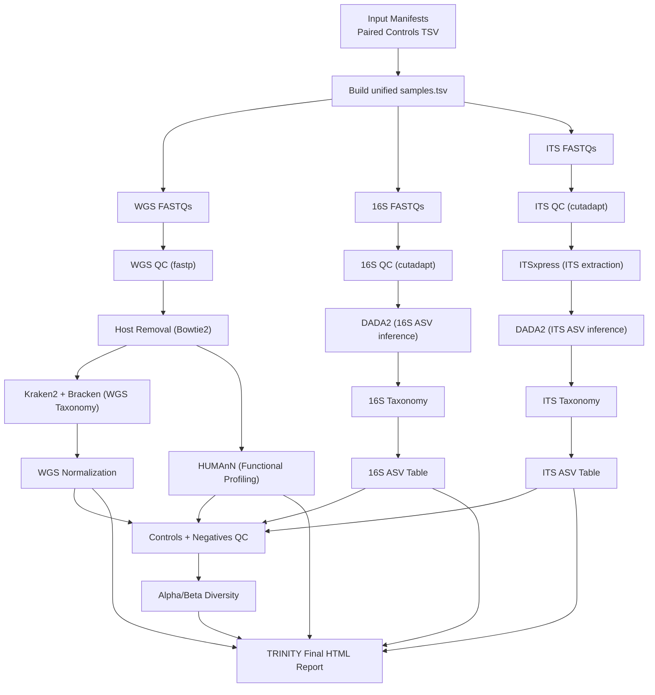

```mermaid
flowchart TD

    A["Input Manifests<br/>Paired Controls TSV"] --> B["Build unified samples.tsv"]

    %% Branch start
    B --> WGSFASTQ["WGS FASTQs"]
    B --> S16FASTQ["16S FASTQs"]
    B --> ITSFASTQ["ITS FASTQs"]

    %% WGS pipeline
    WGSFASTQ --> WGSQC["WGS QC (fastp)"]
    WGSQC --> HOSTREM["Host Removal (Bowtie2)"]
    HOSTREM --> KRBRACK["Kraken2 + Bracken (WGS Taxonomy)"]
    HOSTREM --> HUMANN["HUMAnN (Functional Profiling)"]
    KRBRACK --> WGSnorm["WGS Normalization"]

    %% 16S pipeline
    S16FASTQ --> S16QC["16S QC (cutadapt)"]
    S16QC --> S16DADA["DADA2 (16S ASV inference)"]
    S16DADA --> S16TAX["16S Taxonomy"]
    S16TAX --> S16TABLE["16S ASV Table"]

    %% ITS pipeline
    ITSFASTQ --> ITSQC["ITS QC (cutadapt)"]
    ITSQC --> ITSX["ITSxpress (ITS extraction)"]
    ITSX --> ITSDADA["DADA2 (ITS ASV inference)"]
    ITSDADA --> ITSTAX["ITS Taxonomy"]
    ITSTAX --> ITSTABLE["ITS ASV Table"]

    %% Controls
    WGSnorm --> CTRL["Controls + Negatives QC"]
    S16TABLE --> CTRL
    ITSTABLE --> CTRL
    HUMANN --> CTRL

    %% Diversity
    CTRL --> DIV["Alpha/Beta Diversity"]

    %% Final report
    DIV --> REPORT["TRINITY Final HTML Report"]
    WGSnorm --> REPORT
    S16TABLE --> REPORT
    ITSTABLE --> REPORT
    HUMANN --> REPORT


```
